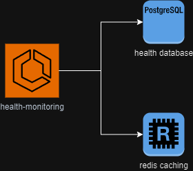
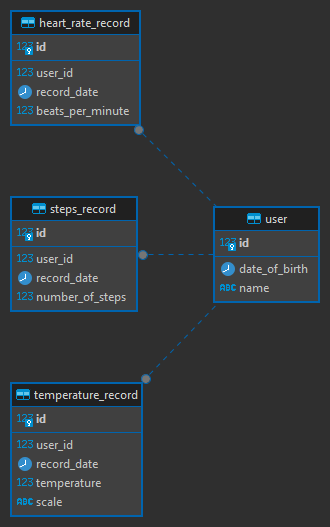

# Health Monitoring

Application to manage a user's health data, including:

- User management;
- Record temperature data and obtain daily data according to specific date;
- Record steps data and obtain daily data according to specific date;
- Record heart beat data and obtain daily data according to specific date.


### Dependencies

- Docker
- JDK 17


### Running the tests
```
make test
```

### Running the application
```
make run
```

### Project Diagram


### Entity Relationship Diagram


### Swagger documentation

http://localhost:8080/swagger-ui/index.html
